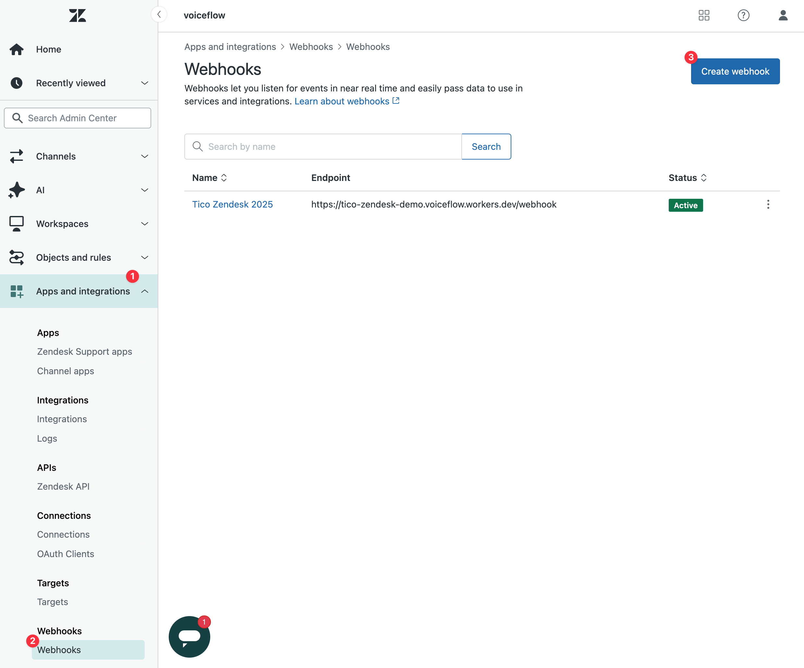
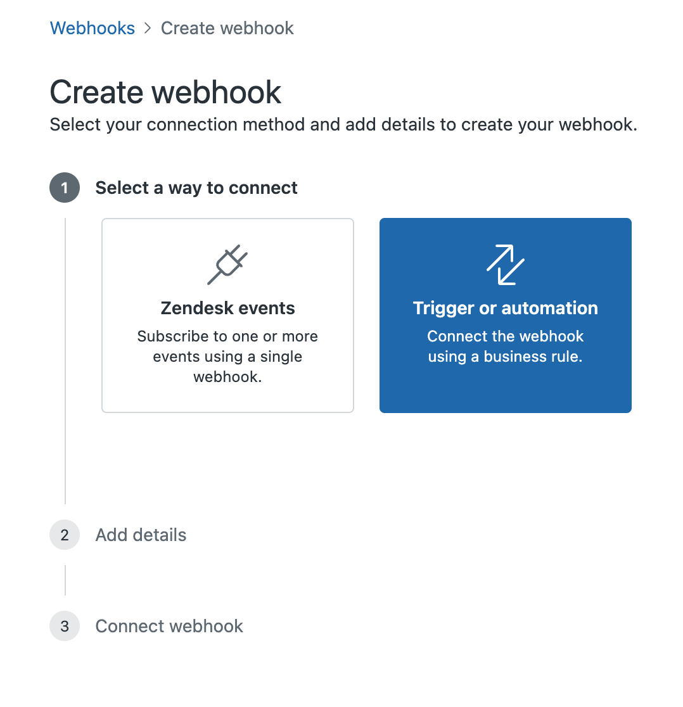
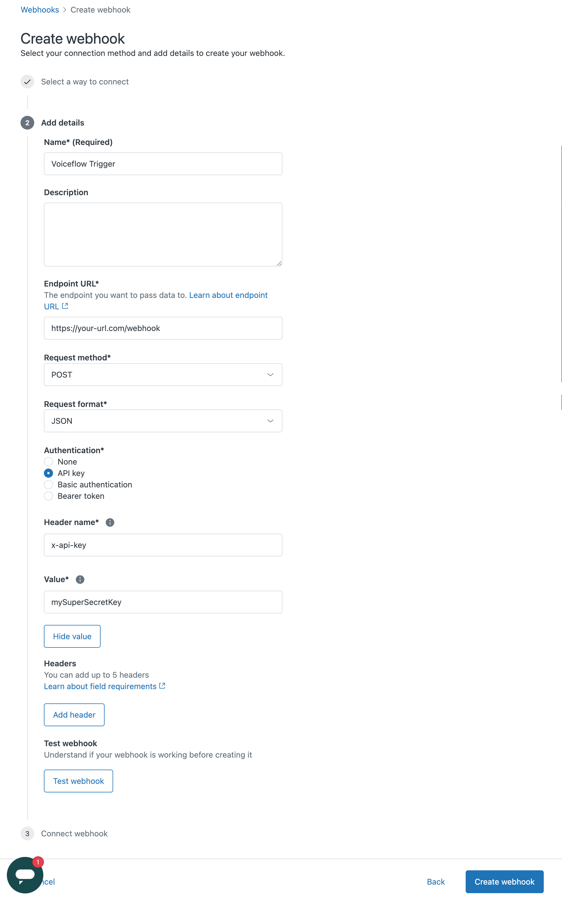
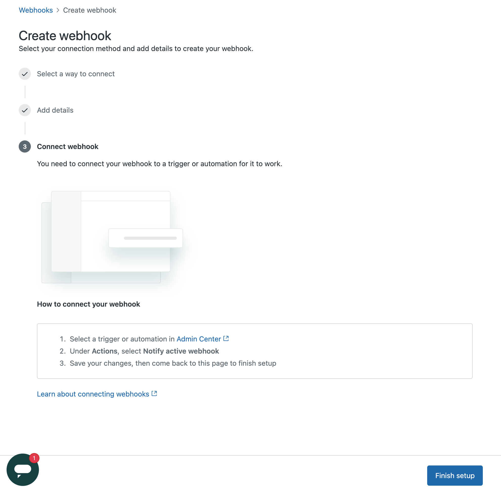
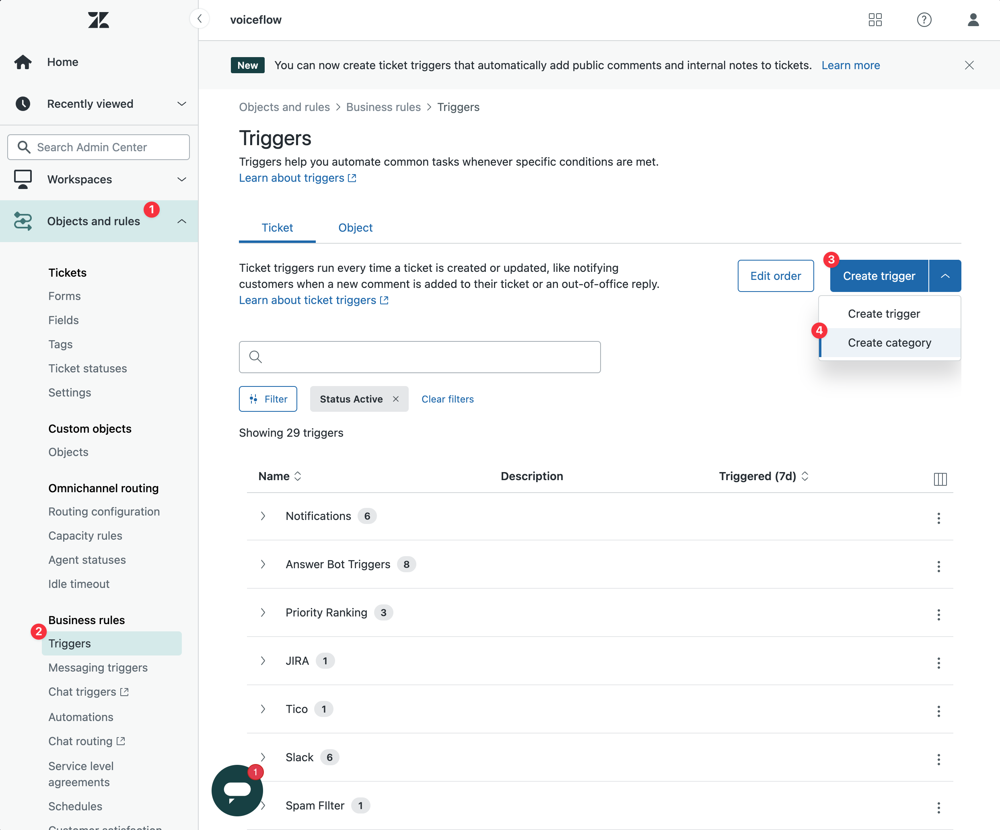
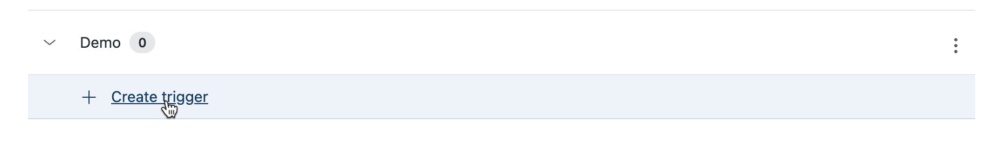
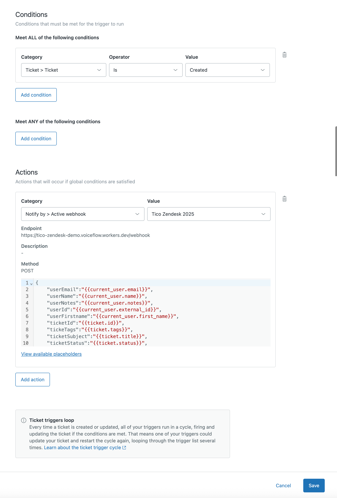
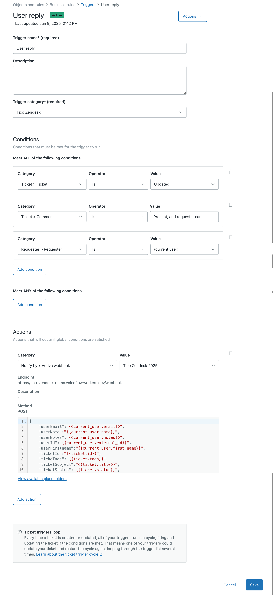

# Zendesk Webhook & Trigger Setup Guide

This guide will walk you through setting up a Zendesk webhook and connecting it to triggers, so you can send ticket data to your integration (e.g., Cloudflare Worker or n8n workflow).

---

## 1. View Existing Webhooks
Navigate to **Admin Center > Apps and integrations > Webhooks** to see your existing webhooks.



---

## 2. Create a New Webhook
Click **Create webhook**.



Choose **Trigger or automation** to connect the webhook using a business rule.

---

## 3. Enter Webhook Details
Fill in the webhook details:
- **Name**: e.g., `Voiceflow Trigger`
- **Endpoint URL**: Your integration endpoint (e.g., `https://your-url.com/webhook`)
- **Request method**: `POST`
- **Request format**: `JSON`
- **Authentication**: `API key` (set header name and value as needed)



Click **Create webhook** after filling in the details.

---

## 4. Connect Webhook to a Trigger
After creating the webhook, you need to connect it to a trigger.



---

## 5. Go to Triggers
Navigate to **Objects and rules > Business rules > Triggers**.



---

## 6. Create a New Trigger
Click **Create trigger**.



---

## 7. Set Trigger Conditions and Actions
Set up the conditions for when the trigger should fire (e.g., when a ticket is created or updated). In the **Actions** section, select **Notify by > Active webhook** and choose your webhook.

Paste the following JSON in the POST body:

```json
{
	"userEmail":"{{current_user.email}}",
	"userName":"{{current_user.name}}",
	"userNotes":"{{current_user.notes}}",
	"userId":"{{current_user.external_id}}",
	"userFirstname":"{{current_user.first_name}}",
	"ticketId":"{{ticket.id}}",
	"tickeTags":"{{ticket.tags}}",
	"ticketSubject":"{{ticket.title}}",
	"ticketStatus":"{{ticket.status}}",
	"ticketDescription":"{{ticket.description}}",
	"ticketLatestComment":"{{ticket.latest_comment_html}}",
	"ticketPriority":"{{ticket.priority}}",
	"requesterId":"{{ticket.requester.external_id}}",
	"requesterName":"{{ticket.requester.name}}",
	"requesterFirstname":"{{ticket.requester.first_name}}",
	"requesterEmail":"{{ticket.requester.email}}",
	"requesterLastname":"{{ticket.requester.last_name}}",
	"requesterPlanType":"{{ticket.ticket_field_5661060584461}}",
	"requesterCBPlanType":"{{ticket.ticket_field_28352035440141}}",
	"requesterId":"{{ticket.ticket_field_15612854194701}}"
}
```



---

## 8. Example: User Reply Trigger
You can create additional triggers, such as for user replies, with more specific conditions.



---

## 9. Save and Test
Click **Save** to activate your trigger. Test by creating or updating a ticket in Zendesk to ensure the webhook fires and data is sent to your endpoint.

---

You have now set up a Zendesk webhook and connected it to triggers to automate data delivery to your integration!
